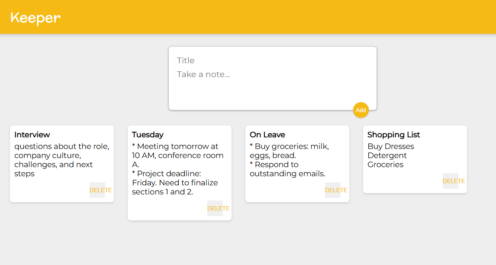

# 📝 Keeper App

A simple React-based note-taking application inspired by Google Keep. It allows users to add, display, and delete short notes dynamically.

---

## 🚀 Features

- ✍️ Add notes with a title and content
- 🧾 Display all created notes in a clean layout
- ❌ Delete individual notes
- 📦 Component-based architecture (React)

---

## 🛠️ Built With

- [React.js](https://reactjs.org/)
- Functional components & React Hooks (`useState`)
- JSX & CSS

---

---

## ⚙️ How to Run Locally

1. **Clone the repository**
   ```bash
   git clone https://github.com/your-username/keeper-app.git
   cd keeper-app
2. **Install dependencies**
    ```bash
    npm install

 3. **Start the development server**
    ```bash  
    npm start
4.**Open in Browser**
http://localhost:3000


**Preview**


**Live Demo**

**repo**

